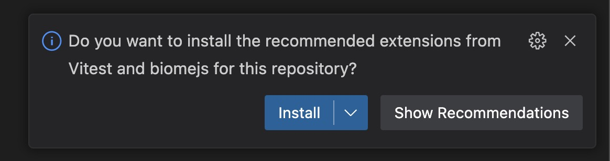

# @NoAds web workspace

> Workspace para os projetos webs do NoAds.

## Pre-requisitos

Antes de começar, precisamos de algumas ferramentas instaladas:

- [NodeJS](https://nodejs.org/en) na versão 20.11.1
- [pnpm](https://pnpm.io/) na versão 8.15.4

Caso você utilize o VS Code como ferramenta de desenvolvimento, será exibida uma caixa de notificação perguntando se você deseja instalar as extensões recomendadas pelo nosso projeto. Você pode instalar sem receio.



A respeito do ambiente de desenvolvimento (Node.js e pnpm), é extremamente importante que às versões sejam as mesmas, pois assim, todos os contribuidores poderão reproduzir os projetos de maneira semi-identica e evitar problemas de ambiente de desenvolvimento.

> **Recomendação**
>
> Existem ferramentas que ajudam a fazer esse controle automaticamente.
>
> Para as versões de Node, temos o [Volta](https://docs.volta.sh/guide/), o [ASDF](https://asdf-vm.com/contribute/documentation.html#initial-setup), o [NVM](https://github.com/nvm-sh/nvm), e até mesmo o próprio [pnpm](https://pnpm.io/cli/env).
>
> Caso você opte por utilizar o NVM, basta executar os comandos
>
> 1. `nvm install` para instalar a versão que padronizamos via .nvmrc.
> 2. `nvm use` para setar essa versão no seu ambiente
>    Caso tenha dúvidas pode consultar: [Utilizando versões antigas do Node.js](https://woliveiras.com.br/posts/utilizando-versoes-antigas-do-nodejs/)
>
> Já para o NPM, recomendamos fortemente a instalação do [corepack](https://github.com/nodejs/corepack), que é uma ferramenta oficial do Node.js que gerencia as versões dos gerenciadores de pacotes (npm, yarn, pnpm, etc) automaticamente. Aqui estão os passos de como usar:
>
> 1. Instale o corepack globalmente com npm (ou pnpm): `npm install -g corepack`
> 2. Rode o comando para "ativar" a versão do pnpm que a gente vai usar: `corepack prepare pnpm@8.15.4 --activate`
> 3. Vá na sua configuração de terminal (.bash_profile, .zshrc, etc.), e adicione o seguinte alias: `alias pnpm="corepack pnpm"` ou execute o seguinte comando, alterando o arquivo `.zshrc` para seu arquivo de configuração `echo "alias pnpm='corepack pnpm'" >> ~/.zshrc`.
> 4. Reinicie seu terminal ou execute o comando `source ~/.zshrc` mudando `.zshrc` para o seu arquivo de configuração.
> 5. Para verificar se está tudo OK, execute o comando `pnpm --version`

## Começando

Primeiro, faça o clone do repositorio.

Em seguida, na raiz do projeto, rode o seguinte comando:

```bash
pnpm i
```

Feito isso, todas as dependencias de todos os projetos vão ser instaladas.

Como este projeto é um monorepo, ele segue a seguinte estrutura:

- root (`./`): é o ponto de partida do projeto. Aqui a gente vai ter o `package.json` central que vão ter dependencias para manutenção do repositorio. **Nenhuma dependencia especifica de projeto deve ser instalada aqui**.
- packages (`./packages/*`): a pasta onde packages que pode ser reutilizadas em outros projetos vai ficar.
- apps (`./apps/*`): a pasta dos projetos em si.

Sobre dependências: trabalhando com monorepos, nós temos as dependências globais, que são comuns a todos os projetos dentro do monorepo, e as locais, que são exclusivas de cada projeto. Caso o seu projeto possua algo muito específico, que você tem certeza que não será utilizado por outros projetos, você deve rodar a instalação da depdendência dentro da pasta desse projeto em questão.

Sobre a pasta packages: aqui é onde deve viver a maior parte do nosso código. Componentes, módulos e tudo o que seria compartilhado em uma aplicação, devem ser construídos dentro desta pasta a vias de compartilharmos estes códigos entre todos os projetos.

Sobre a pasta apps: aqui nós reúnimos todas as coisas. Aqui estará a base para a construção de páginas e juntar nossos componentes e módulos para transformar em um projeto em questão.

## Rodando um projeto

Imagine que você queira rodar o comando `dev` do projeto chamado `@noads/webapp`. Em um monorepo, há duas maneiras de rodar o comando de um projeto específico.

A primeira é na raiz do repositório a segunda é dentro da pasta do projeto em questão.

### 1. Rodando a partir da raiz do repositório

Abra o terminal e rode o comando

```bash
pnpm --filter @noads/webapp run dev
```

Caso o projeto não exista ou o comando esteja errado, você receberá uma mensagem `No projects matched the filters in...`.

OBS: A flag --filter pode ser usada para qualquer comando pnpm, inclusive no `add`, que adiciona novas dependências no nosso repositório.

```bash
pnpm --filter @noads/webapp add -E lodash-es
```

Neste exemplo, estamos adicionando `lodash-es` ao projeto `@noads/webapp`.

### 2. Rodando a partir da pasta do projeto em questão

Você pode navegar até o projeto e rodar o comando dentro de seu diretório:

```bash
cd ./apps/webapp && pnpm run dev
```

---

Para exemplificar este processo, temos um projeto demo em nosso repositório.

Você pode rodar o comando `pnpm --filter @noads/demo-project run dev` e o comando `dev` será executado no projeto `demo-project`.

Caso queira rodar algum comando através do Turbo (que vai rodar todos as dependencias em cascata), é a quase a mesma coisa. A única diferença é que agora você precisa passar `turbo`:

```bash
pnpm turbo --filter @noads/webapp run dev
```

> [!Note]
> Vale ressaltar que o comando só vai funcionar se ele estiver listado dentro do `./turbo.json[pipelines]`.

## Ferramentas do projeto

Esse projeto foi configurado com às seguintes ferramentas:

- pnpm: gerenciamento de dependencias e controle do workspace entre as packages e apps;
- biome: substituto do ESLINT e Prettier, mas escrito em Rust. Ele já tem suporte pra TypeScript nativamente e roda extremamente rapido.
- turbo: o motor do monorepo. Com essa ferramenta é possível rodar comandos em ordem de importancia entre as packages e os projetos. Também faz um trabalho de cachear os processos que já foram executados, evitando rodar comandos desnecessariamente.

## Criando uma nova package

<!-- TODO -->

## Criando um novo projeto

<!-- TODO -->
